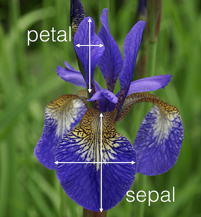
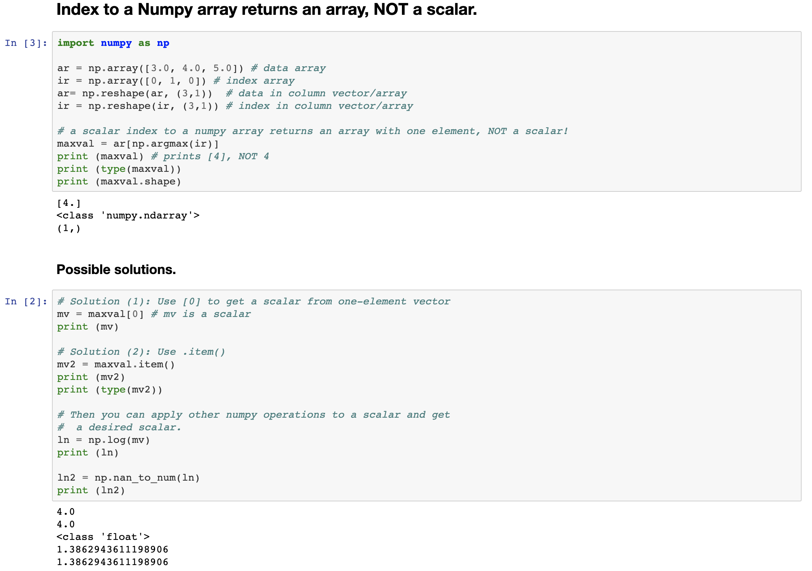
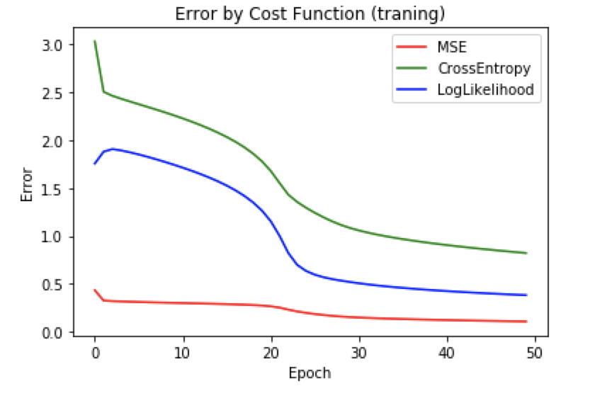
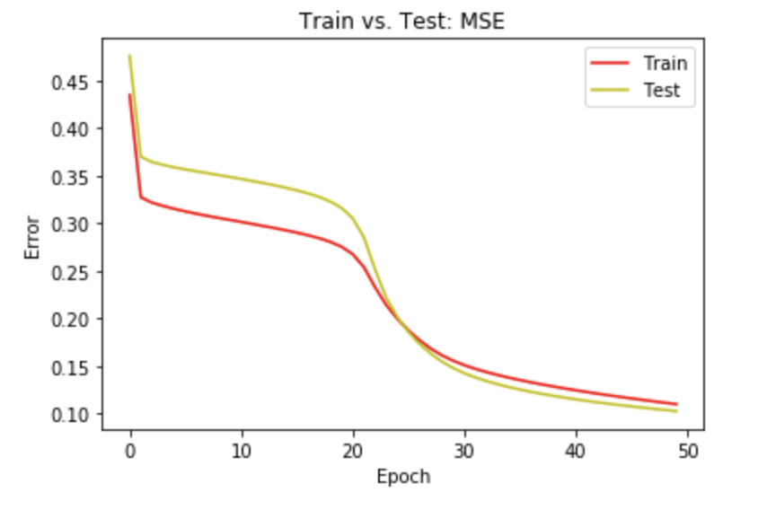
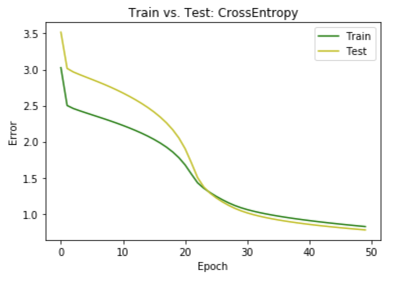
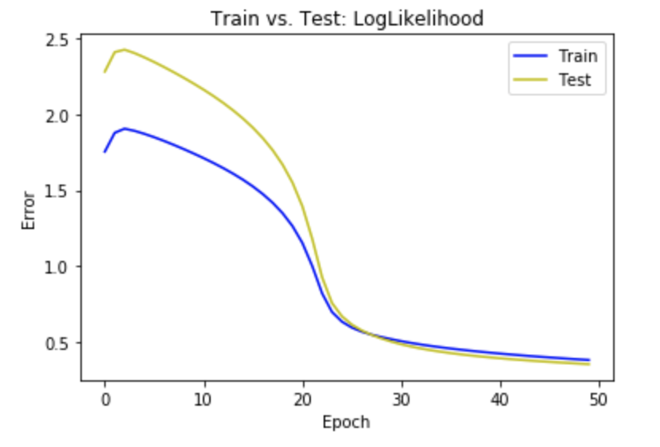

# Implementation of Neural Network
Implementing Neural Network on the infamous Irish dataset. 

On Irish dataset (uploaded on data folder here as well as on https://archive.ics.uci.edu/ml/datasets/iris), this algorithm evalutes: accuracy, Mean Squared Error (MSE), Crossentropy and log-likelihood. Followed by that, the function returns those five results that are correctcount, accuracy, MSE, Crossentropy and Loglikelihood in a list

This code is adopted from NNDL book by Nielson from Chapter 1; the original code is network.py (uploaded here on the the dataset folder.) In this code the target variable (y) of a dataset is assumed to be a vector of the form 'one-hot-vector' representation, which is a list of all 0's with exactly 1 for the target class. For instance, if there were four target classes in the dataset aka multiclass classification problem, and a specific instance's target class was 'three', the target was encoded as [0,0,1,0]. This encoding scheme is known as 'categorical' format.

 

 

 

On Nielson's code, this script (which is NN_network.py) edits the evakute() function. MSE from Eq. (6), cross-entropy from Eq. (57 or 63) and loglikelihood from Eq. (80). NOTE: on loglikelihood equation 80, the formula is missing 1/n in the begining on Nielson's book. 

NOTE: Each cost function must return a scalar value, not an array.

- For MSE and Cross-entropy look at the two function classes, QuadraticCost and CrossEntropyCost on network2.py file.

- For loglikelihood, you have to pick out the activation value of a node for which the target y array has a one - represented by (binarised) 'one-hot-vector'. Provided that you get first obtain the index to the node by calling argmax to the target y and give the index to the output layer's activation array, one would return a probelm -- Numpy's subcript operator returns an array with one element, instead of a scalar. This is because the activation values of a layer are stored in column vectors rather than row. Check out the code below for that: 

 

We are also editing the functions SGD() for training_data, at the end of each epoch, and print the resturned results. 
Collecting the performance results from evaluate() for all epochs for trainin_data and test_data into indovidual lists, and return the two lists in a list. 

The backprop() function has the local variable 'activations' so it is initially allocated with a structure which holds the activation value of all layers in the network from the start instead of starting with just the input layer by "activations = [x]" and appends one layer at a time by "activations.append(activation)". 

net1 network is trained [from "iris-423.dat"] with the iris data ["iris.csv"] by calling SGD() for a maximum of 100 epochs, minibatch_size=5, eta=0.5.  No specific value should be passed in for 'stopaccuracy' to take the default (1.0). 
The results should match with the numbers shown in this file -- "Results-1.txt." Then, create another network by reloading the same saved network and train the network with the same three hyperparameter values AND additionally with stopaccuracy=0.75.  The output results will be the same from the previous run, but should stop after the training accuracy reached above 0.75.

A new network was created by loading the saved 4-20-7-3 network, then train the network using the same hyperparameters from the last run [epochs=100, minibatch_size=5, eta=0.5, stopaccuracy=0.75].  The results should match with the numbers shown in this file -- "Results-2.txt"

This script does not call SciKitlearn or other packages but rather is about hard coding. It beings with shuffling the instances in the original dataset, and takes the first 70% as the training and the rest as the test. Then create a new network with randomly initialized weights of the size [4,20,3].  Create a new network by simply calling the constructor as: net4 = network.Network([4,20,3]). Then train the network for 50 epochs with eta = 0.1 and the mini batch size = 5 (and take the default for stopaccuracy). Save the results. 

Test versus Train output should look something like this:

From "Neural Network and Deep Learning" book by Michael Nielsen. Free online version available @ http://neuralnetworksanddeeplearning.com/

